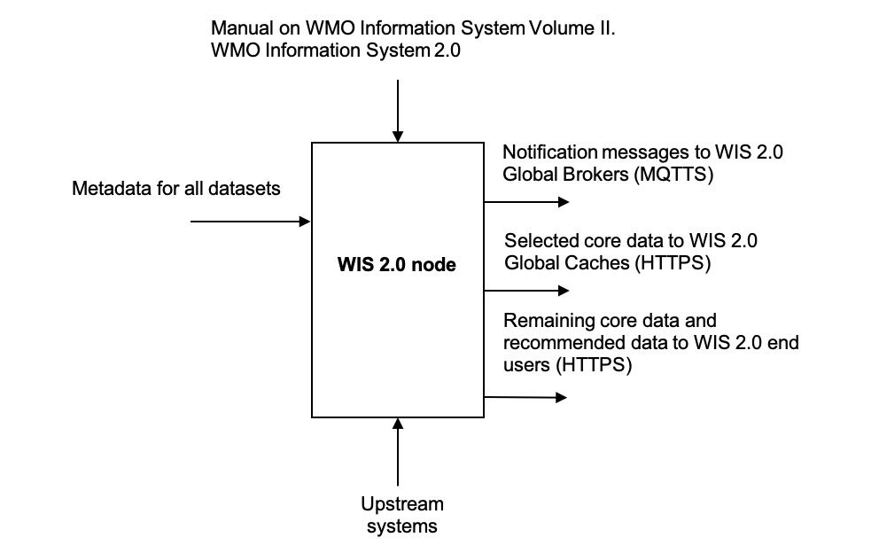

= WIS 2.0 node - User requirements specifications
:toc:
:toclevels: 2
:toc-title: Table of Contents

== Introduction

=== Applicable Documents

[width="100%",cols="20%,20%,60%",options="header",]
|===
| |*Document Title* |*Reference*
|AD-0 a|
Manual on WMO Information System Volume II. WMO Information System 2.0
| https://library.wmo.int/records/item/68731-manual-on-the-wmo-information-system-volume-ii-wmo-information-system-2-0
|===

=== Reference Documents

[width="100%",cols="20%,20%,60%",options="header",]
|===
| |*Document Title* |*Reference*
|RD-0 |WMO Information System 2.0 Guide |https://library.wmo.int/records/item/69130-guide-to-the-wmo-information-system-volume-ii
|RD-1 |WMO Information System 2.0 Strategy |https://library.wmo.int/doc_num.php?explnum_id=4620
|RD-2 |WIS 2.0: How to define successful transition? |https://wmo-teams.atlassian.net/wiki/spaces/WIS2/pages/301957121/WIS2.0+how+to+define+successful+Transition
|===

== System overview

=== System Context

The WIS 2.0 node will be available to receive data from the upstream data production system, and to serve these data via the internet to the WIS 2.0 environment.

The WIS 2.0 node will be available to receive metadata and to serve these metadata via the internet to the WIS 2.0 environment.

WIS 2.0 Global Brokers will subscribe to the WIS 2.0 node, and will receive publication messages when data and metadata become available.

*WIS 2.0 node*

. Selected core and recommended data from upstream systems

. Notification messages to WIS 2.0 Global Brokers

. Selected core data to WIS 2.0 Global Caches

. Subscription messages from WIS 2.0 Global Brokers

. Remaining core data and recommended data to WIS 2.0 end users

[[IDEF0_Context_Diagram.jpg]]
.IDEF0 Context Diagram

=== External Interfaces

As identified in the context diagram <<IDEF0 Context Diagram>>, the WIS 2.0 node will have external interfaces with WIS 2.0 Global Brokers, and WIS 2.0 Global Caches. In each case, the communications will be via the internet.

The Global Brokers will subscribe to the MQTT broker on the node. This will be done using the standard MQTT secure port, 8883.

The Global Caches will retrieve core data from the node by accessing the HTTP server on the node.

End users will retrieve core data not retained by the Global Caches from the node by accessing the HTTP server on the node. End users will also retrieve recommended data from the node by accessing the HTTP server on the node, subject to appropriate access control.

=== Concepts and Constraints

The WIS 2.0 node will be compliant with the Manual on WMO Information System Volume II. WMO Information System 2.0 ++[++AD-0++]++.

== User requirements

The purpose of the WIS 2.0 node (hereafter, referred to as the Node) is to be available to receive data from the production system, and to serve these data via the internet to the WIS 2.0 environment.

In order to reach this target, the following high-level user requirements need to be fulfilled:

*_USR-0001_*

The Node shall comply with the specification given in the Manual on WMO Information System Volume II. WMO Information System 2.0, ++[++AD-0++]++.

*_USR-0101_*

The WIS 2.0 node shall include an MQTT broker, using MQTT 5.0 (hereafter, referred to as the Broker).

*_USR-0150_*

The Broker included in the Node shall be accessible via MQTT protocol over the internet.

*_USR-0201_*

The Node will allow subscriptions from the WIS 2.0 Global Brokers.

*_USR-0210_*

The Node will restrict subscriptions to the Broker by only WIS 2.0 Global Brokers by filtering their incoming IP addresses as made available by WMO Secretariat.

*_USR-0220_*

Access to the Broker shall be password controlled.

*_USR-230_*

The secure version of MQTT (MQTTS) shall be used. The use of SSL certificates to support this shall be maintained over the lifetime of the system.

*_USR-240_*

The Broker shall publish messages using MQTT’s Quality of Service (QoS) level 1. This is defined as follows: “_The broker/client will deliver the message at least once, with confirmation required._”.

*_USR-0301_*

Upon the arrival of data for distribution via WIS 2.0, the Broker shall publish an MQTT message announcing the availability of the data.

*_USR-0320_*

Notification messages published by the Node shall be formatted in geoJSON, in accordance with the Manual on WMO Information System Volume II. WMO Information System 2.0, ++[++AD-0++]++.

*_USR-0340_*

Notification messages published by the Node shall be published using an MQTT topic defined in accordance with the WIS 2.0 topic hierarchy.

*_USR-0360_*

The MQTT topic used in notification messages shall not be configured to retain messages.

*_USR-0401_*

The Node shall provide access to core data via HTTP over the internet.

*_USR-0450_*

The Node shall provide access to recommended data via HTTP over the internet, subject to appropriate access control.

*_USR-0500_*

The Node shall provide access to core data via HTTPS over the internet.

*_USR-0550_*

The Node shall provide access to recommended data via HTTPS over the internet, subject to appropriate access control.

*_USR-0601_*

The Node shall support the retrieval core data by the WIS 2.0 Global Caches.

=== Extract from the Manual on WMO Information System Volume II. WMO Information System 2.0 ++[++AD-0++]++:

FUNCTIONAL REQUIREMENTS OF A WIS NODE

3.6.1 General

3.6.1.1 A WIS node is the component that enables an NC or DCPC to publish their data and discovery metadata via WIS.

3.6.1.2 See also 3.3 (Functional requirements of an NC) and 3.4 (Functional requirements of a DCPC).

3.6.2 Provide access to data and discovery metadata

3.6.2.1 A WIS node shall provide access to data in accordance with the WMO Unified Data Policy (Resolution 1 (Cg-Ext-2021)).

3.6.2.2 A WIS node shall allow one or more Global Caches to access and download core data it publishes for real-time and near real-time exchange. Global Caches provide highly available access to copies of these resources.

3.6.2.3 A WIS node may restrict access to its core data, relying on Global Caches providing access to data consumers.

3.6.2.4 A WIS node may provide access to data using a Web-based Application Programming Interface (API).

3.6.2.5 A WIS node shall provide access to discovery metadata describing the data it makes available and how that data can be accessed. Discovery metadata from a WIS node is added to the Global Discovery Catalogue to create a consolidated view of data available from all WIS nodes.

3.6.2.6 A WIS node shall have the capability to publish notifications via a Message Broker.

3.6.2.7 A WIS node shall publish notifications via its Message Broker about updates to the data and discovery metadata it provides – including the availability of new data, changes to discovery metadata, and removal of a data set from WIS.

3.6.2.8 A WIS node shall use a standardized topic structure when publishing notifications. Note: More information on the standardized topic structure is provided in the Guidance on technical specifications of WIS 2.0.

3.6.2.9 A WIS node shall allow one or more Global Brokers to subscribe to notifications published via its Message Broker. Global Brokers provide highly available distribution of notifications published by a WIS node.

3.6.2.10 See also 4.3 (WIS-TechSpec-2: Publishing data and discovery metadata).

Note: More information on the function and implementation of a WIS node is provided in the Guidance on technical specifications of WIS 2.0.

3.6.3 Monitor performance of a WIS node

3.6.3.1 Each WIS node shall contribute to monitoring the performance of WIS.

3.6.3.2 See also 4.7 (WIS-TechSpec-6: Managing operations of the WIS).
